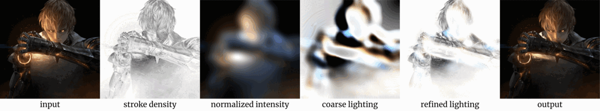

# Implementation + Extension of [PaintingLight](https://lllyasviel.github.io/PaintingLight/)

**[Presentation](https://docs.google.com/presentation/d/11h1rFe97pVQZDWV8gAXsBswo3PWs1rGX_lYK5CgOXZg/edit?usp=sharing)**

To produce gifs, choose images in `main.py` and run `python main.py`.

To interact with a re-lighting example, choose an image in `interact.py` and run `python interact.py`.

To check out spotlight feature, set `use_spotlight = True` in `lighting_vectorized.py` --> `computeCoarseLightingEffect`.

To check out specular highlight feature, choose images in `main_specular.py` and run `python main_specular.py`